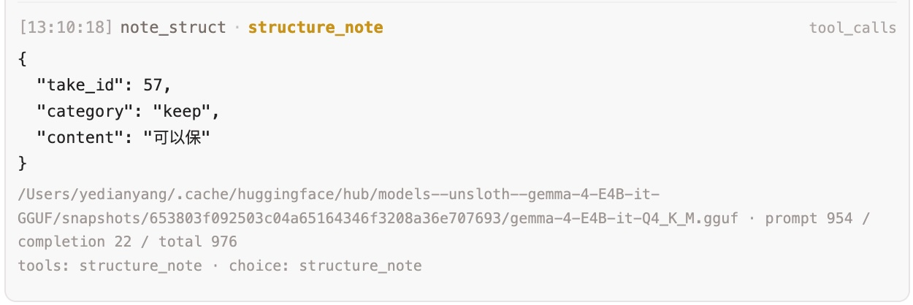
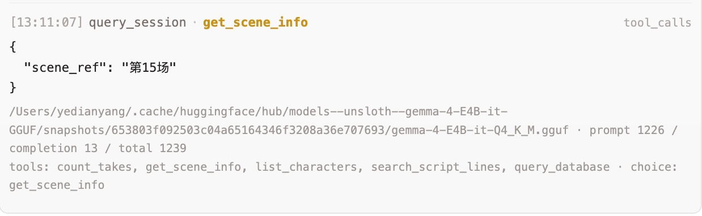

# Soundspeed 技术报告

> **Gemma 4 开发者大赛（GDG Shanghai · 2026）**
> 面向电影同期录音部门的**本地离线 AI 场记助手**——用**一个 Gemma 4 E4B** 同时承担文本理解、剧本照片识别与语音查询，配合**贯穿全栈的原生函数调用**，在一台 M4 Mac Mini 上完成"录音 → 理解 → 结构化场记"的全离线闭环。

---

## 一、问题与真实影响

**同期录音（production sound）现场的场记工作，至今高度依赖人工纸笔。** 每条镜头（take）拍摄时，场记要同时盯住：这条说了什么、和剧本有没有出入、哪句台词被改/被漏/被加、录音质量如何、导演有没有口头备注、是哪个演员说的。一条戏几十上百条 take，信息量大、节奏快，人工记录既慢又易漏，而这些"片场元数据"直接决定后期剪辑与导演决策的效率。

**Soundspeed 把这套流程自动化，并坚持"全部在片场本地、离线完成"**：

- **录音师 / 场记** 在录制时实时拿到逐字转写、实录↔剧本逐行对照、说话人归属、口头备注的结构化归档；
- 收工即可导出**场记单（CSV）**，无需事后誊写；
- 影视项目的剧本与录音是**高度保密资产**，云端方案存在合规与泄密风险——Soundspeed 不依赖任何云 API，数据不出本机，天然适配片场保密要求。

目标用户是同期录音部门，要替代的是纸笔场记；对中小成本剧组，它让专业级场记不再依赖昂贵的后期人力。

---

## 二、为什么选择 Gemma 4 E4B

Soundspeed 的硬约束是：**片场无稳定公网、数据必须本地、只有一台小型本地设备（M4 Mac Mini）**。在此约束下逐项权衡四个规格：

| 规格 | 是否选用 | 理由 |
| --- | --- | --- |
| **E4B（端侧）** | ✅ **选用** | `Q4_K_M` 量化后在一台 M4 Mac Mini（Apple Silicon 统一内存 + Metal）上即可全离线流畅运行；在中文台词理解、原生函数调用稳定性、视觉 OCR 质量上明显优于 E2B，是"能落到片场本地设备 + 质量够用"的最优平衡点。 |
| E2B（端侧） | ✗ | 资源更省，但长 take 的函数调用结构化、密集中文剧本 OCR 稳定性不足，质量风险偏高。 |
| 26B MoE | ✗ | 吞吐与质量更高，但体量/算力超出 M4 Mac Mini 这类端侧设备，更适合云端——与"离线 + 隐私"诉求冲突。 |
| 31B Dense | ✗ | 同上，定位云端高负载，不满足端侧离线落地。 |

**E4B 一个模型就原生覆盖了我们需要的全部能力**——文本推理、视觉、音频、原生函数调用。这让"片场只部署一个模型实例，却能读图、听懂语音、调工具"成为可能。在端侧落地、原生多模态、函数调用三者的交集上，E4B 是当前最合适的规格。

> 模型坐标：`unsloth/gemma-4-E4B-it-GGUF` 的 `gemma-4-E4B-it-Q4_K_M.gguf` + `mmproj-F16.gguf`（一份 F16 投影器同时含 `gemma4v` 视觉与 `gemma4a` 音频两路）。首次运行自动从 HuggingFace 拉取；`mmproj` 缺失/离线时自动降级为纯文本（视觉/语音暂不可用），联网后首条多模态请求会补拉。

---

## 三、系统架构总览

### 3.1 核心理念：Gemma 4 是"理解层"，专用模型是"捕获层"

我们使用两层架构：专用模型负责语音转文本，提高整体的可靠性与准确性；理解层由同一个 Gemma 4 负责。

- **捕获层（高保真、确定性）**：录音的**逐字转写由 Whisper（`pywhispercpp`）**完成，**说话人 / 声纹识别由 Pyannote（`pyannote.audio` 4.0）**完成。它们把声音"原样"变成带时间戳的文本与说话人标签。**Gemma 4 不参与转写与声纹识别。**
- **理解层（语义、结构化、跨模态）**：**同一个 Gemma 4 E4B 实例**承担所有"需要理解"的任务——实录↔剧本比对、备注结构化、自然语言查询、剧本照片 OCR，以及**直接听懂用户口述的查询/备注**。文本、图像、语音指令都经由同一个 `MultimodalGemma4Handler` 进入这一个模型。

这一分工既发挥了 Whisper/Pyannote 在逐字精度与声纹上的专业优势，又用单个 Gemma 4 把所有语义与跨模态环节收敛到同一个模型。

> **本地推理基座**：Gemma 4 由 **`llama.cpp`（经其 Python 绑定 `llama-cpp-python`）** 加载 GGUF 权重推理——`Gemma4ChatHandler` + `mtmd` 多模态、Flash Attention、grammar 约束采样都建立在这条基座上；Apple Silicon 的 PyPI wheel 自带 Metal 后端，无需自行编译即可吃满统一内存 + GPU。捕获层的 Whisper 同样走 `whisper.cpp`（`pywhispercpp`）。两条 `.cpp` 基座 + 量化 GGUF，正是"4B 多模态 + 实时 ASR 全部塞进一台 M4 Mac Mini 离线跑"的底座。

### 3.2 事件驱动编排（Orchestrator）

```text
麦克风音频 ──► Whisper ASR ──► 逐字转写片段（ch1/ch2，带 start/end frame）
                                   │
                          Orchestrator.publish("asr.final.*")  →  写入 transcript_segments
                                   │
                       take.end 事件 ──────────────┐
                                   │（先同步出态、再异步补 script_diff，前端立刻有反馈）
                 ┌─────────────────┴───────┐   ┌───┴────────────────────────┐
                 ▼                          ▼   ▼                            ▼
        L2（实录↔剧本对照）        NP（备注结构化）      Pyannote 分离回填（复用 ASR 文本不重跑）
                 └──────────┬───────────────┘
                            ▼
              LLMService（单例·优先级队列·单 worker·全局锁串行）── 同一个 Gemma 4 E4B
              infer() / infer_tool() / infer_voice() / infer_voice_tool()
                            │
                  WebSocket 广播 + 写库（SQLite）
```

- **单实例 + 优先级队列**：一份 Gemma 权重被剧本解析、L2、备注结构化、查询、OCR、语音调度六类任务争用；用 `asyncio.PriorityQueue` + 单 worker + 全局锁把所有推理**串行化**，优先级 **QP 用户查询(1) > L2/NP 后台分析(2) > 剧本解析(3)**，保证人在交互时优先响应。
- **运行档位（`SOUNDSPEED_PROFILE`）**：`import` 档让 Gemma 充分用满本机算力做解析/视觉；`record` 档把算力让给 Whisper + Pyannote、Gemma 退 CPU。底层有 GPU/CPU 自适应回落（独显环境按可用显存判定、统一内存环境可手动切档），让"重 LLM"与"重 ASR"两阶段都能在单机跑顺。
- **运行时调优**：`n_ctx=8192`（容纳 5 分钟以上长 take + 上百行剧本），开启 Flash Attention 降低长上下文的内存开销与延迟。

---

## 四、Gemma 4 能力的深度运用

### 4.1 单实例三模态 + 运行时热切 chat handler（多模态与函数调用共存的关键工程）

得益于 Gemma 4 对听、看、读的多模态支持，我们用**同一个 Gemma 4 实例**服务三种输入：

- 给 client 注入 `mmproj` 后挂上 `MultimodalGemma4Handler`，文本、图像、语音共用同一份权重与 KV；
- 但这个多模态 handler 的对话模板**不渲染工具声明**——也就是说"文本 + 工具"的请求里模型看不到工具。为此，client 在遇到"文本 + tools"请求时，**临时把 chat handler 换成由 GGUF 内嵌模板构造的原生 FunctionGemma formatter（会渲染工具），推理后再还原**，靠全局锁串行保证无竞态。

这一步"按需热切 handler"让一个实例既能多模态、又能原生函数调用。

### 4.2 原生函数调用（Native Function Calling）—— 全栈贯穿

函数调用是 Soundspeed 把"模型输出"变成"可落库结构化数据"的核心机制，按任务形态分了三种策略：

| 管线 | 工具 | 模式 | 作用 |
| --- | --- | --- | --- |
| **L2 实录↔剧本分析** | `report_script_analysis` | forced（具名 tool_choice） | 逐行匹配（漏说/替换/新增）+ 修正片段 |
| **NP 备注结构化** | `structure_note` | forced | 把口头/文字备注归到正确 take 并分类 |
| **Memo 路由** | `route_memo` | forced（16-token 二分类） | 输入分流到 note / query 分支 |
| **单场剧本解析** | `report_parsed_lines` | forced（grammar 路径） | 单场更新时把文本结构化为逐行 |
| **QP 会话查询** | `count_takes` / `get_scene_info` / `list_characters` / `search_script_lines` / `query_database` | `auto`（多跳自主路由） | 模型自主选工具、执行、回喂、续跳作答 |

七类任务最终都收敛到 `LLMService` 的四个推理入口，由统一队列串行调度：

```text
backend/pipelines/*               入口(LLMService)         模式           优先级
──────────────────────────────────────────────────────────────────────────
l2_take.run_l2_take          ─► infer_tool              forced          2
np_note.run_np_note          ─► infer_tool              forced          2
np_note.run_np_voice         ─► infer_voice_tool        forced          2
memo_route.classify_memo     ─► infer_tool              forced(16-tok)  1
sp_script.parse_scene_block  ─► infer                   无 grammar       3
sp_script.parse_scene_block_fc► infer_tool              forced+grammar   3
qp_query.run_tool_loop       ─► infer → infer_tool ×N   auto → forced    1
voice_dispatch.run_*         ─► infer_voice → infer_voice_tool  auto→forced  1
                                ├─ note  分支 → structure_note
                                └─ query 分支 → query_session → run_tool_loop 续跳
──────────────────────────────────────────────────────────────────────────
全部经 PriorityQueue + 单 worker + 全局锁 串行   用户态(QP/语音/memo)=1 > L2/NP=2 > 剧本解析=3
```

- **四个推理入口的正交分解**：`infer`（文本→内容）、`infer_tool`（文本→工具调用）、`infer_voice`（音频→内容）、`infer_voice_tool`（音频→工具调用），由 `want_tool_call × audio` 两个正交维度叉乘而成，共用同一条入队/调度路径，没有重复实现。
- **forced vs auto 两种调度**：结构化落库（L2/NP/路由/单场解析）用 forced，由 grammar 在采样层物理保证输出合法 JSON；多工具问答（QP）用 auto 让模型自主路由。
- **工具 schema 与下游校验同源**：L2 的 `diff_type`、备注的 `category` 等枚举抽到中性叶子模块（`l2_constants` 等），grammar 约束的合法值与 pipeline 校验取同一真源，杜绝"schema 与校验漂移"。

### 4.3 grammar 的成本权衡 → 冷热路径分流

我们发现 grammar（GBNF 约束采样）在 Gemma 约 25 万词表上每 token 的 CPU 开销显著、吞吐大幅下降（内部测得约 **5.6×** 量级）。据此做冷热分流：

- **整本剧本解析（热路径）刻意不用 grammar**：用纯代码正则按场头切分（`split_scenes_by_slugline`），再让 Gemma 逐行自由吐 `[说话人, 台词]`，配多层容错解析兜底（解析失败退化到冒号启发式，台词原文永不丢）。"能用代码就别用模型、模型只做必须的语义判断"。
- **grammar / 强制 FC 只留给低频路径**：单场更新、路由、QP 取参。

### 4.4 视觉：照片直接更新剧本

- **逐页 OCR**：剧本照片经同一个 Gemma 4 视觉投影器转写（`IMAGE_TOKENS=1120` 高分辨率档，专为密集中文小字调高）。**逐页单图**喂入（不一次喂多图），避免小模型一次看多图时整段复读。
- **OCR 越界续写的多层兜底**：小模型常不在回合边界停、越界吐 `<|turn|>` 等标记再乱写/复读。对此做了三道闸——生成期 `stop` 列表遇回合标记即停 + `repeat_penalty`；事后 `_strip_special_tokens` 截掉特殊标记后的续写；`_dedup_repeated_lines` 折叠连续/近窗重复行。
- **结构化走无 grammar 快路径**：OCR 文本偏长，强制 grammar FC 会超时（实测多页超时），故照片路径用无 grammar 的 `parse_scene_block` 结构化（与 §4.3 的冷热分流一致）。
- **增量合并（不再整段覆盖）**：端点 `POST /api/v1/scenes/{scene_id}/script/diff` 用标准库 `difflib.SequenceMatcher` 把 OCR 结果与该场旧版逐行对齐（确定性、不调 LLM）：**未变留旧 / 改动取新 / 新增加入 / 旧有新无则保留旧**。最后一条尤为关键——小模型 OCR 难免漏字漏行，"保留旧"确保增补不会删掉原内容；提交的 `raw_text` 由合并结果重建，保证落库 `raw_text↔lines` 一致与幂等。用户在彩色逐行对照里复核后再确认。

### 4.5 语音查询：原生音频输入（真正的多模态体现）

项目里**真正调用 Gemma 4 原生多模态**的地方，是**"标记 / 查询"输入支持直接语音**：场记/录音师按住说一句话（如"第三场拍了几条？"），**原始 WAV 不经转写，直接进入 Gemma 4**，由模型直接"听懂"口语意图。

- **音频哨兵通道**：WAV 字节不放进对话消息，消息里只放一个占位 `AUDIO_SENTINEL`；真字节在串行锁下暂存单槽位，handler 命中哨兵时取回——借 `mtmd` 对音频/图像通用的媒体标记，把音频塞进既有图像通道，让一份实例无缝多服务一种模态。
- **两跳调度**：hop A 用自由生成"听懂意图"——工具声明以 GGUF 原生 `<|tool>…<tool|>` 格式（用 `vocab_only` 秒级加载提取、`lru_cache` 缓存）注入 system，让模型自发吐出该调哪个工具；hop B 用强制 tool_choice 在同一段音频上取结构化参数 → 执行查询/落库备注 → 广播答案。
- **边界说明**：录音的逐字转写（Whisper）与说话人/声纹识别（Pyannote）**不经过 Gemma**；Gemma 4 的音频能力专门用于"直接听懂用户口述的查询/备注"。

至此，**文本（推理与结构化）、图像（剧本 OCR）、语音（口述查询）三类输入都由同一个 Gemma 4 E4B 原生处理**。

### 4.6 QP：本地小模型上的稳健 agentic tool-loop

QP（场记查询）是"模型自主多跳工具调用"，针对 4B 级小模型函数调用易抖动做了专门工程：

- **两步走解码**：每一跳先用 `auto` 让模型吐出工具名（正则从原生 `<|tool_call>call:NAME` 里抠，名字稳定地出现在参数之前），再用 forced + grammar 取**干净 JSON 参数**——不在自由文本里解析嵌套参数。最多 5 跳。
- **避开模板坑**：回喂刻意用"`assistant` 原文 + `user` 纯文本"而非 OpenAI 的 `role=tool`——后者会触发该 GGUF Jinja 模板的 `raise_exception undefined`。
- **`query_database` 只读 SQL"万能笔" + 沙箱**：除 4 个结构化工具外，第 5 个工具允许模型**自己写一条只读 SELECT** 兜底长尾问题；执行走独立 `mode=ro` 连接 + `set_authorizer` 动作级放行（仅 SELECT/READ/FUNCTION，拒 ATTACH/写/`load_extension`）+ 单句守卫 + 行数封顶 + 超时中断——把"让 LLM 直接执行 SQL"这一高危能力收进多层纵深防御的沙箱。
- **错误回喂自纠**：工具执行的任何异常都被包成 `{"error": ...}` 回喂，模型下一跳自我纠正，而非整轮失败。

### 4.7 可观测性：函数调用实时遥测

`LLMService` 暴露一个无侵入的 tool-call tap：每次函数调用成功后，把工具名、参数、可用工具、`finish_reason`、token 用量经 WebSocket 实时广播到管理面板的开发者日志。可以**实时看到模型在调哪个工具、用了多少 token**，便于调试与现场演示。

**管理面板运行日志示例：**

下图是 NP（备注结构化）管线中 `structure_note` 工具的 forced 调用——模型将语音备注「可以保」结构化归档到 take 57，category 判定为 `keep`，并显示本次调用的 token 消耗（prompt 954 / completion 22 / total 976）：



下图是 QP（查询）管线中模型自主选择的 `get_scene_info` 工具调用——用户查询「第15场」信息，模型从 5 个可用工具中选出 `get_scene_info` 并填入参数 `scene_ref: "第15场"`：



---

## 五、工程化设计（节选）

- **异步分发与 async 约束**：`take.end` 用 `asyncio.create_task` fire-and-forget 触发 L2/NP。相关端点必须 `async def`，同步函数会被丢进线程池、没有 running loop，L2 不会触发；这一点定为模块契约。
- **并发模型**：DAL 用单个 `check_same_thread=False` 共享连接 + WAL + `BEGIN IMMEDIATE`，所有路由强制 async，把 DB 访问钉在事件循环单线程串行，与 L2 异步任务共用同一连接而不冲突。
- **数据层一致性**：剧本**版本追加、读取只取最新版**（历史可追溯）；无号场用源文本内容指纹做稳定 ID，避免同一剧本重传累积重复场；take 号位冲突在单事务内原子解析（软删号可复用、被编辑 take 顺位加后缀）；备注用 `take_events` 事件溯源 + 派生聚合，多写者（用户 Mark / L2 / memo / NP）共写一行不同列时用 `COALESCE` 做部分更新、互不覆盖。
- **检索基座**：台词检索用 FTS5 `trigram` tokenizer（中文无需分词即可子串匹配）+ BM25 排序，外部内容表 + 触发器与源表保持一致。
- **分离回填**：实时 ASR 与离线 diarization 解耦，回填只把说话人标签 UPDATE 回既有转录段（不重跑 Whisper），并把"本 take 在场演员数"作为先验喂给 Pyannote，降低单麦相似音色塌成一人的概率；enroll 与 diarize 共用同一 embedding 空间，跨 take 才能认出同一人。
- **健壮性**：推理超时即取消、worker 跳过已取消任务；对"配了强制 tool_choice 却误调 `infer`"给显式护栏（不静默返回 None）；路由与语音分类都 **fail-closed**（分类器失败也不挡备注提交）；模型后端抽象成 `Protocol` + `StubClient`，无 GPU / 无模型也能跑全链路测试；进程重启自动复位残留的"解析中"上传、恢复活跃场上下文。

---

## 六、移动端控制：手机即遥控台

Soundspeed 前端是标准 Web 应用并做了**移动端响应式适配**，因此**同一 Wi-Fi 下用手机浏览器即可远程操控片场的这台后端**，无需安装任何 App。

- **手机作遥控**：场记/录音师不必守在主机前——手机打开 `/admin` 就能标记 take、发查询、拍剧本照片上传、记口头备注。
- **语音指令驱动 agent**：手机上按住说一句话，原始语音经局域网直达后端的 Gemma 4，由它**听懂意图 → 选工具 → 取参 → 执行**（如口述「这条 keep」完成标记、「第三场拍了几条」即时作答）——把 §4.5 / §4.6 的语音多模态与 agentic 函数调用，落成「对着手机说」的交互。
- **仍然全程局域网、不出公网**：手机只连本机局域网地址，数据不经任何云，延续离线与隐私基调。
- **零改前后端的工程实现**：手机麦克风只在 secure context（HTTPS）下放行，故用 Caddy 在 `:8443` 作唯一 HTTPS 终止点、对前后端两个 HTTP 服务**同源反代**，业务代码零改动；配 mkcert 本地 CA 自签证书，手机装一次根 CA 即可。一条 `scripts/setup-https.sh` 自动完成证书与构建配置。

---

## 七、功能完备性

**已端到端跑通：**

- 实时双声道 ASR（Whisper + VAD）、说话人分离（Pyannote）与即时回填同步
- **L2** 实录↔剧本逐行序列对齐并置 + 替换/漏说/新增判定（强制函数调用）
- **NP** 文字/语音备注结构化归档；**QP** 自然语言查询多跳作答，**支持语音输入**
- **SP** 剧本上传解析 / 单场更新 / **照片视觉 OCR + 增量合并**（版本化，旧版保留）
- 管理面板（History 并置视图、剧本面板、场次导航/更新、函数调用实时日志）、**场记单 CSV 导出**
- **移动端控制**：手机经同 Wi-Fi 局域网 HTTPS 远程操作 `/admin`（录语音备注/查询、拍传剧本照片）
- SQLite 持久化、FastAPI REST + WebSocket、React 前端

---

## 八、合规性

- **数据隐私**：全程本地离线，录音 / 剧本 / 备注等敏感数据不出本机、不经任何云服务，符合数据隐私要求。
- **训练数据**：不做任何微调、不引入外部训练数据，能力来自 Gemma 4 的纯推理 + 提示工程 + 原生函数调用。
- **模型来源**：Gemma 4 E4B 权重取自 HuggingFace `unsloth/gemma-4-E4B-it-GGUF`，遵循 Google Gemma 使用条款；本项目以 Apache-2.0 开源。
