# Audio Input Layer 设计

- 日期：2026-05-20
- 分支：spike/audio-input-layer
- 版本：v0.3（整合 Codex 评审 + 下游 Voice Activity Layer 流程澄清）
- 来源：Lead 与用户头脑风暴产出

## 1. 目标与背景

Soundspeed 后端是一条本地离线音频处理流水线（2026-05-20 细化，在 ASR 前插入
Voice Activity Layer）：

```
音频采集（本层）→ Voice Activity Layer（VAD 切语音段）→ Cactus ASR
  → take 检测 / 转录合并 → Gemma agent → SQLite
```

Audio Input Layer 是其中「音频采集」阶段，只负责把各种音频源规整成统一格式
（16kHz 单声道 int16、按声道拆开）。它是流水线的最上游；其**直接下游是
Voice Activity Layer，不是 ASR**。

设计依据来自两个调研实验：

- `experiments/2026-05-20-cactus-asr-probe/` —— 确认 Cactus ASR 的输入硬约束。
- `experiments/2026-05-20-soxr-gil-probe/` —— 确认重采样的并行策略。

## 2. 职责与边界

**职责：** 把一个音频源（实时设备或音频文件）规整成 16kHz 单声道 int16 的 PCM 流，
按时间切片、按声道拆分，往下游吐。

**在范围内：**

- 实时设备采集（声卡 / 虚拟声卡 / USB 音频接口 / 录音机 line out）。
- 音频文件作为音频源（批处理）。
- 采样率重采样到 16kHz。
- 多声道按声道拆分为独立单声道。
- dtype 规整为 int16。
- 防静默失败：保证输出格式，否则明确抛错。

**不在范围内：** 见第 11 节。

## 3. 核心约束

来自 cactus-asr-probe 实验：

- **输出必须是 16kHz 单声道 int16 PCM。** Cactus ASR 用 48kHz 双声道喂入会全程
  空输出、不报错（静默失败）。Audio Input Layer 的核心价值就是挡住这类 bug。
- 输出采样率 `16000`、dtype `int16`、每路单声道 —— 是**契约常量**，不可配置。
  改了下游静默失败。

## 4. 架构

```mermaid
flowchart TD
    CFG["AudioConfig<br/>chunk_ms / max_channels（源无关行为配置）"]
    CFG -. 配置 .-> DEV
    CFG -. 配置 .-> FILE

    subgraph LAYER["Audio Input Layer（只负责输入归一化）"]
        direction TB
        ABC{{"AudioSource 抽象基类<br/>上下文管理器 + 迭代器"}}

        DEV["DeviceSource<br/>声卡 / 虚拟声卡 / USB接口 / 录音机line-out<br/>sd.InputStream 阻塞 read（实时节奏）"]
        FILE["FileSource<br/>WAV / BWF 文件<br/>soundfile 顺序读（尽快批处理）"]

        ABC -. 实现 .-> DEV
        ABC -. 实现 .-> FILE

        DEV -->|"原生采样率, N 声道"| READ
        FILE -->|"原生采样率, N 声道"| READ

        READ["读一块原始音频<br/>★ DeviceSource 与 FileSource 在此汇流，往下路径完全一致 ★"]
        READ --> TRUNC["取前 max_channels 路<br/>其余声道丢弃（不报错）"]
        TRUNC --> SPLIT["按声道拆分为独立单声道 ch0 / ch1<br/>（从此互不混合）"]

        SPLIT --> CP0["ChannelProcessor ch0<br/>soxr.ResampleStream 重采样 → 16k<br/>dtype → int16"]
        CP0 -->|"接着处理下一声道（顺序）"| CP1["ChannelProcessor ch1<br/>soxr.ResampleStream 重采样 → 16k<br/>dtype → int16"]

        CP1 --> CHUNK["AudioChunk = 一个时间切片的容器<br/>channels：各声道独立单声道数组并列存放<br/>★ 不混音 / 不交织 / 非立体声 ★<br/>seq / sample_rate=16000 / n_frames / start_frame"]
    end

    CHUNK ==>|"yield：for chunk in source"| CONS["下游消费者"]

    subgraph VADLAYER["Voice Activity Layer（独立下游层 —— 本 spec 不含，另立 spec）"]
        direction TB
        VAD0["ChannelVADSegmenter ch0<br/>VAD + pre/post roll，维护 speech buffer"]
        VAD1["ChannelVADSegmenter ch1<br/>VAD + pre/post roll，维护 speech buffer"]
    end

    CONS -->|"channels&#91;0&#93;"| VAD0
    CONS -->|"channels&#91;1&#93;"| VAD1
    VAD0 ==>|"SpeechSegment ch0<br/>audio / start_frame / end_frame"| ASR0["ASR 引擎 A：Cactus 会话<br/>只转录 ch0"]
    VAD1 ==>|"SpeechSegment ch1<br/>audio / start_frame / end_frame"| ASR1["ASR 引擎 B：Cactus 会话<br/>只转录 ch1"]
    ASR0 -. 转录结果（带 start_frame）.-> MERGE["下游按 start_frame 时间对齐合并<br/>（take 检测 / 场记单，不在本层）"]
    ASR1 -. 转录结果（带 start_frame）.-> MERGE
```



**组件：**

- `AudioSource`（抽象基类）—— 统一接口。上下文管理器（`__enter__`/`__exit__`
  管理设备流 / 文件句柄）+ 拉取式迭代器（`__iter__`/`__next__` 产出 `AudioChunk`）。
  用法 `with source as s: for chunk in s: ...`。
- `DeviceSource(device, config)` —— 实时采集。`device` 为设备名或索引，`config`
  为 `AudioConfig`。`__enter__` 用 sounddevice 按设备原生采样率、原生声道数开
  `InputStream`；`__next__` 阻塞 `read()` 读一块、处理、返回 `AudioChunk`；
  `__exit__` 关流。无后台线程、无队列 —— 阻塞 read 本身就是实时节奏与拉取语义。
- `FileSource(path, config)` —— 文件源。`path` 为文件路径，`config` 为
  `AudioConfig`。`__enter__` 用 soundfile 打开文件；`__next__` 顺序读一块、处理、
  返回；EOF 时 `StopIteration`。尽快批处理，不模拟实时节奏。结构与 DeviceSource
  对称。
- `ChannelProcessor` —— 模块化单声道处理单元。持有一个 `soxr.ResampleStream`
  （有状态）。输入某一声道在源原生采样率下的单声道样本，输出 16kHz int16
  单声道。每声道一个实例。
- `AudioChunk` —— 输出数据结构，见第 5 节。
- `AudioConfig` —— 配置对象，见第 5 节。

**数据流（每次 `__next__` 跑一遍）：**

读一块原生采样率、N 声道的原始音频 → 取前 `max_channels` 路、其余丢弃 →
按声道拆成独立单声道 → 每声道**顺序**过 `ChannelProcessor`（soxr 重采样到 16k、
转 int16）→ 组装成一个 `AudioChunk` → yield。DeviceSource 与 FileSource 仅
「读一块」一步不同，其后路径完全一致。

## 5. 关键数据结构

### AudioChunk

一个 `AudioChunk` 是**一个时间切片的容器**，横跨该切片的所有声道。

| 字段 | 类型 | 说明 |
|---|---|---|
| `seq` | int | 单调递增序号，从 0 起 |
| `channels` | list[np.ndarray] | 按声道序号索引，每个是该声道的 16kHz 单声道 int16 一维数组 |
| `sample_rate` | int | 恒为 16000 |
| `n_frames` | int | 每声道帧数（同一 chunk 内各声道相等） |
| `start_frame` | int | 本 chunk 首帧距流开始的帧偏移；时间戳 = start_frame / 16000 |

**关于 `channels`，必须说清楚（这是本设计反复澄清过的要点）：**

`channels` 是各声道**各自独立的单声道数组并列存放**。它**不是立体声、不交织、
不混音**。`channels[0]` 是第 0 路的独立单声道信号，`channels[1]` 是第 1 路的
独立单声道信号，两者从不被合并成一条信号。即便在同一个 `AudioChunk` 容器里，
各声道也是各自独立的数组 —— 容器只是把同一时刻的它们「装在一起」，装在一起
不等于合并成一条。

每一路独立喂给下游 Voice Activity Layer 的对应声道 VAD 切段器（`channels[0]`
→ ch0 的 `ChannelVADSegmenter`，`channels[1]` → ch1 的），各声道独立做 VAD、
各自切出语音段，再分别送进独立的 ASR 引擎。各路全程互不相干。

把多声道打包进同一个 `AudioChunk` 的**唯一目的**是共享 `seq` / `start_frame`，
给下游做时间对齐 —— 下游（VAD 切段器据此给 `SpeechSegment` 标注绝对帧位置、
更下游把各路转录结果合并成场记单）需要知道「第 0 路在 T 时刻」和「第 1 路在
T 时刻」是同一刻。bundle 提供这个免费的、结构性的时间对齐，仅此而已。

背景：电影同期录音一个音频源通常含 boom 和 lav 两路，是同一场戏的两个不同
麦克风视角，不是立体声的左右声场。两路都要各自转录。

### AudioConfig

承载**源无关的行为配置**，DeviceSource 与 FileSource 共用同一份：

| 参数 | 默认 | 说明 |
|---|---|---|
| `chunk_ms` | 200 | 每次读取的块时长（毫秒），按输入侧定义 |
| `max_channels` | 2 | 处理前 K 路声道，见第 6 节 |

源的「身份」不属于 `AudioConfig`，而是各源自己的构造参数：`DeviceSource` 的
`device`（设备名或索引）、`FileSource` 的 `path`（文件路径）。

`16000` / `int16` / 单声道是契约常量，不进配置。前端将来可改的可配项是
`AudioConfig` 这两项，外加选设备 / 选文件（前端如何把值传进来是后端 API 的事，
不属本层）。

## 6. 声道处理规则

- 输入 1 路 → 处理 1 路。
- 输入 2 路 → 处理 2 路。
- 输入 >2 路（譬如 8 声道多轨）→ **取前 2 路（index 0、1），其余丢弃，不报错。**
- DeviceSource 与 FileSource 规则一致。
- 发生丢弃时打一条 info 日志（如「输入 8 声道，处理前 2 路，丢弃 6 路」）—— 不是
  错误、不打断流程，只为可见性：避免录音师把重要对白放在第 3 路而本层默默忽略
  却无从排查。
- 声道**顺序循环**处理，不用线程池。依据 soxr-gil-probe 实验：1-2 声道、200ms 块
  工况下，单声道重采样仅 22 微秒，线程池调度开销（几十微秒）压倒收益，并行实测
  慢 1.42 倍。`ChannelProcessor` 保持模块化独立单元，N 声道扩展即循环多跑几次
  （N=8 也才约 180 微秒，可忽略）。
- 未来「前端手动选处理哪些声道」不在本期范围；模块化的 `ChannelProcessor` +
  `max_channels` 是该功能将来的接入点。

## 7. 重采样与依赖

**重采样由本层显式做，不依赖驱动隐式重采样。**

cactus-asr-probe 是开 `InputStream(samplerate=16000)` 让 PortAudio 隐式重采样。
问题：一是不是所有设备 / 驱动支持任意目标采样率，有的只认原生率；二是隐式
重采样质量不可控。文件源更是根本没有隐式重采样。

所以：DeviceSource 按设备**原生采样率**开流，FileSource 按文件原生率读，统一走
`ChannelProcessor` 里的 `soxr.ResampleStream` 重采样到 16k。两条路径一致，质量
自己掌控。输入已是 16k 时重采样为 no-op。

分块实时音频必须用**有状态的流式重采样器**（`soxr.ResampleStream`），不能对每块
独立 one-shot —— 否则块边界有 artifact。故每声道一个独立的 `ResampleStream`
实例（也是 `ChannelProcessor` 必须每声道一个实例的原因）。

流式重采样器有滤波延迟，首块输出帧数偏少（实测 9600 输入帧首块出 2936，稳态约
3200）。因此 chunk 大小按输入侧 `chunk_ms` 定义，输出 `n_frames` 为权威值，
下游不得假设固定帧数。

**依赖（4 个，均为音频处理标准库，体量小）：**

| 包 | 用途 |
|---|---|
| `sounddevice` | 实时设备采集（PortAudio 绑定），probe 已验证 |
| `soundfile` | 文件读取（libsndfile 绑定），支持 WAV / BWF / AIFF / FLAC |
| `soxr` | 重采样，soxr-gil-probe 已验证 Python 3.14 可用（abi3 wheel） |
| `numpy` | 数组运算 |

新依赖按 CLAUDE.md 需 plan 审批，于 plan 阶段钉死版本。

## 8. 错误处理

本层是「防静默失败」关口。原则：**要么保证输出 16kHz 单声道 int16，要么明确
抛错，绝不静默输出错的东西。**

| 情况 | 处理 |
|---|---|
| 设备名 / 索引不匹配、找不到 | 构造 / `__enter__` 时抛错，错误信息列出可用设备 |
| 设备采集中途断开 | 抛 `DeviceError`，不静默 |
| 文件不存在 / 格式不支持 | 抛错 |
| 设备消费跟不上、缓冲溢出 | `sd.InputStream.read()` 的 `overflowed` 标志被检测，计数 + 告警，不静默丢 |
| 输入声道 >2 | 取前 2 路，info 日志，不报错（第 6 节） |
| 文件 EOF | 迭代器正常 `StopIteration` |

## 9. 测试策略

TDD（CLAUDE.md 强制）：测试 commit 在实现 commit 之前。测试放 `backend/tests/`，
夹具放 `backend/tests/fixtures/`。

- **`ChannelProcessor`** —— 48k→16k 输出帧数；已是 16k 时透传；float32→int16
  定点转换；int16 输入路径。纯单元，易测。
- **`FileSource`** —— 喂已知夹具 WAV，断言 chunk 数、声道数、`sample_rate==16000`、
  dtype int16、总帧数；立体声夹具→每 chunk 2 声道，单声道夹具→1 声道；>2 声道
  夹具→只出 2 声道；EOF 行为。
- **`DeviceSource`** —— 把「原始多声道数组 → AudioChunk」的处理逻辑做成不依赖
  真实设备的纯逻辑，用合成数据测；真实 `sd.InputStream` 采集那一薄层留手动测试，
  对应 commit 标 `[手动测试]`，并在 GitHub Issue 写人工验证步骤。
- **夹具** —— 小 WAV，合成正弦用 soundfile 生成：一个 48k 立体声、一个 16k
  单声道、一个非常规采样率（如 44.1k）、一个 >2 声道（如 4 声道）。

## 10. 文件布局

`backend/` 尚未初始化，以下子包路径为暂定，待 `backend/` 初始化时定死。

```
backend/audio/
  __init__.py
  source.py          # AudioSource 抽象基类, AudioChunk, AudioConfig
  device_source.py   # DeviceSource
  file_source.py     # FileSource
  channel.py         # ChannelProcessor
backend/tests/
  test_channel_processor.py
  test_file_source.py
  test_device_source.py
  fixtures/*.wav
```

## 11. 范围外（YAGNI）

明确不做，避免设计膨胀：

- Voice Activity Layer（VAD 语音切段、pre/post roll、`SpeechSegment`）—— 独立的
  下游层，需单独 brainstorming 与 spec，不在本 spec。
- take 边界检测、Cactus ASR 集成 —— 更下游模块。
- 滚动缓冲 / 整段录制落盘 —— 下游。本层是纯音频源。
- 声道角色标注（Boom/Lav 命名）—— 下游。本层只按序号输出。
- 文件源实时节奏模拟 —— 本期文件源只做尽快批处理。
- 线程池并行声道处理 —— soxr-gil-probe 实验否决。
- N>2 声道的实际处理 —— 设计支持（模块化 `ChannelProcessor` + 顺序循环），
  本期只实现 1-2 路。
- 前端手动选声道 —— 未来功能。

## 12. 待定 / 待验证假设

- `ChannelProcessor` 接 int16 输入（设备路径）时，`soxr` 用 float32 还是 int16
  内部精度 —— 实现时定。
- 运行环境 / Python 版本：本层不 import cactus，不绑定 Cactus venv；但整条
  流水线（音频 → Cactus ASR）须在 cactus 可 import 的环境跑（probe 实测为 brew
  Cactus venv 的 Python 3.14）。本层代码目标 Python 版本待 `backend/` 初始化时
  随后端统一定。
- `backend/audio/` 子包路径暂定，待 `backend/` 初始化定死。
- 依赖具体版本于 plan 阶段钉死。

## 13. 引用

- `experiments/2026-05-20-cactus-asr-probe/README.md` —— Cactus ASR 输入硬约束
  （16k 单声道 int16）、双路径架构、静默失败坑。
- `experiments/2026-05-20-soxr-gil-probe/README.md` —— soxr 释放 GIL 但真实工况下
  顺序处理胜于线程池并行。

注：cactus-asr-probe 实验不随本分支提交，由用户在其自身分支
（`spike/cactus-audio-input`）上单独提交（见第 14 节 Codex 评审记录 P2）。本 spec
对它的引用因此是跨分支的 —— 两个分支都合入 main 后引用才完全可达；在此之前，
实现者需到 `spike/cactus-audio-input` 分支或主 checkout 工作区查阅该实验。

## 14. Codex 评审记录

v0.1 → v0.2，Codex working-tree review（2026-05-20，`/codex:review`）：

| 编号 | 意见 | 处置 | 理由 |
|---|---|---|---|
| P2 | spec 引用的 `experiments/2026-05-20-cactus-asr-probe/` 不在本 patch 的变更里，单独 checkout 本分支无法从仓库验证「16kHz 单声道 int16」硬约束的证据来源。 | 接受（修法按用户决定调整） | 意见有效，与第 13 节自审已标隐患一致。修法不并入本分支，改由用户在 `spike/cactus-audio-input` 单独提交该实验；第 13 节注已据此说明引用为跨分支。soxr 实验与 spec 本身无阻塞意见。 |

注：本期 Codex 评审用 `/codex:review`（native working-tree review），非 CLAUDE.md
所列的 `codex:rescue`；两者均为 Codex 评审，目的一致。

v0.2 → v0.3，用户审批时的下游流程澄清（2026-05-20）：

用户在审批时明确：本层与 ASR 之间存在一个独立的 **Voice Activity Layer**
（按声道独立做 VAD、加 pre/post roll、切出 `SpeechSegment` 再喂 ASR）。本层
（Audio Input Layer）设计本身不变 —— 其输出 `AudioChunk`（每声道独立单声道
16kHz int16 数组 + `seq` / `start_frame` / `n_frames`）正是每声道 VAD 切段器
所需的输入。第 1、4、5、11 节据此把「直接下游」从 ASR 更正为 Voice Activity
Layer；Voice Activity Layer 本身列入第 11 节范围外，另立 spec。
