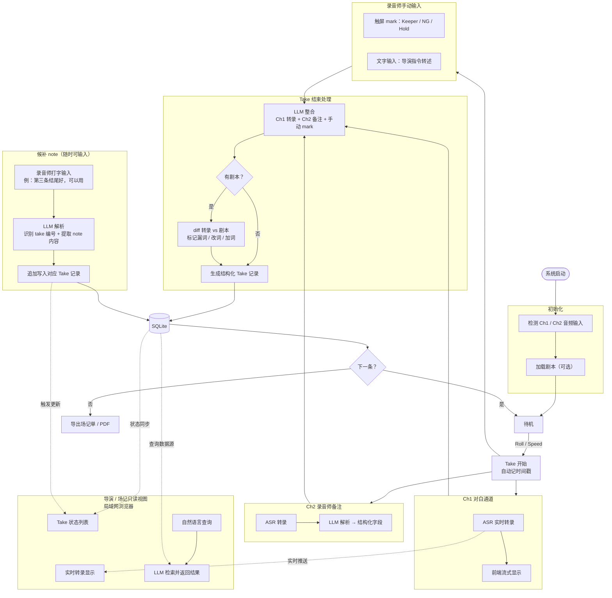

# Spec: 拍摄现场 LLM 用例与 UX 流程

版本：v1.1
日期：2026-05-22
状态：草稿，待审批

变更记录：
- v1.1：补充 ASR 引擎选型结论（依据 framework benchmark）
- v1.0：初稿

---

## 背景

Soundspeed 的核心管道（音频采集 → ASR → 说话人分离 → SQLite）不需要 LLM 参与。
LLM 的价值在数据上方的智能层：理解录音师的口语化输入、语义检索、脚本对比、事后注释解析。
本 spec 定义这个智能层的完整用例、输入来源和 UX 流程。

---

## 用户角色

| 角色 | 设备 | 权限 |
|---|---|---|
| 录音师（主操作者） | 系统主机（Mac mini 等） | 读写：标注、查询、输入 note |
| 导演 / 场记（只读参考） | 手机 / iPad，局域网浏览器 | 只读：实时转录、Take 状态、自然语言查询 |

---

## 输入架构

系统维护两条独立音频输入通道：

**Ch1 — 对白通道**
Boom 或 Lav 信号，采集演员对白。经 ASR 转录后实时推送至前端显示，同时写入 Take 记录。

**Ch2 — 录音师备注通道**
录音师面向自己的专用麦克风，随时口述质量评估和备注。ASR 转录后由 LLM 解析为结构化字段，与当前 Take 时间戳绑定。

此外，录音师可通过前端进行：
- 触屏快速 mark（Keeper / NG / Hold）
- 文字输入（导演指令转述、候补 note）

---

## ASR 引擎选型

依据 `experiments/2026-05-20-whisper-framework-benchmark/`：同一 whisper-medium、
统一 8-bit 量化，在 M1 Max 上对比 Cactus / whisper.cpp / mlx-whisper。

| 框架 | 推理 RTF | 加载(s) | 中文输出 |
|---|---|---|---|
| whisper.cpp (q8_0) | 22.0x | 0.34 | 干净 |
| mlx-whisper (8-bit) | 34.5x | 2.25 | 干净 |
| cactus-whisper (INT8) | 8.3x | 0.52 | 「中」字输出成 `?`（bug） |

结论：

- whisper.cpp 最均衡——推理快、加载最快、输出干净。
- mlx-whisper 推理最快但加载慢，每会话一次加载成本。
- Cactus 三项垫底，且有「中」字 artifact、INT8 medium 冷加载观测到一次 5427s。
  移动引擎在 Mac 上吃不满 GPU。

**决定**：Mac 开发与 demo 阶段，ASR 层用 whisper.cpp。原 CLAUDE.md 架构设想
「Cactus 一套引擎同时跑 ASR + Gemma」，基准否决了这个方案在 Mac 上的可行性——
ASR 与 Gemma 推理引擎现已分离。未来若上手机 / 嵌入式，Cactus 的移动优化会改变
结论，需复测。

---

## 核心 LLM 用例

### 1. 口述备注结构化（Ch2）

录音师说：「这条二号最后一句漏词，收音干净，先 hold。」

LLM 输出：
```
performer_issue: [2]
issue_type: line_fluff
location: 结尾
audio_quality: clean
status: hold
```

比打字快，比规则分类器灵活，能处理口语简称和省略。

### 2. 候补 note（事后追加）

Take 结束后、场次收工后，录音师用文字输入：「第三条结尾比较好，可以用。」

LLM 解析：
- 默认绑定当前场景上下文（最近活跃场次）
- 识别 take 编号（「第三条」→ Take 3）
- 提取 note 内容，追加写入对应 Take 记录
- 跨场引用需显式带场次编号（例：「第五场第二条」）

### 3. 脚本偏差检测

前提：录音师提前加载剧本文本。

每条 Take 结束后，LLM 比对 Ch1 转录与剧本对应台词，输出偏差报告：
- 漏词：演员跳过的台词片段
- 改词：说法与剧本不符
- 加词：临场加入的台词

结果写入 Take 记录，在共享视图中对场记可见。

### 4. Take 对比摘要

录音师或导演发起查询：「这场哪条最稳？」

LLM 读取当前场次所有 Take 记录（状态、Ch2 备注、手动 mark），生成一句话摘要：
「Take 4 收音干净，Take 6 表演最完整，Take 8 结尾有底噪备注。」

摘要质量上限由 Ch2 备注密度决定，没有备注的字段不做推断。

### 5. 语义化查找

查询：「找那条二号演员卡壳的 take。」

LLM 解析意图，跨字段联合检索 SQLite，返回匹配 Take 列表。
可搜索字段：performer_issue、issue_type、audio_quality、note 文本、转录内容。

### 6. 剧本语义检索

查询：「从'我不想走'那里开始。」

LLM 在已加载剧本中定位该台词，返回对应场次 / 镜次编号。
不需要录音师翻纸质剧本，也无需精确关键词。

---

## UX 流程



---

## Take 记录数据结构（草案）

每条 Take 写入 SQLite 的字段：

| 字段 | 来源 | 说明 |
|---|---|---|
| scene | 上下文 | 场次编号 |
| shot | 上下文 | 镜次编号 |
| take_number | 自动递增 | 本场第几条 |
| start_ts / end_ts | 系统时间戳 | Take 起止时间 |
| transcript_ch1 | ASR | Ch1 对白转录全文 |
| status | 手动 mark / Ch2 解析 | Keeper / NG / Hold / TBD |
| performer_issues | Ch2 解析 | 涉及哪个演员、什么问题 |
| audio_quality | Ch2 解析 | clean / noisy / clipped 等 |
| script_diff | LLM | 与剧本的偏差（漏词/改词/加词） |
| notes | Ch2 原文 + 候补 note | 录音师全部文本备注 |

技术层字段（噪音检测、削波等）由信号处理层写入，不归 LLM。

---

## 不在本 spec 范围内

- 音频采集与 ASR 的具体实现（归 backend-asr）
- SQLite schema 详细定义（归 backend-agent）
- 前端 UI 设计与交互细节（前端技术栈待定）
- BWF / iXML 元数据联动（P3 阶段）
- 导演音频直接采集（第三通道，设计成本较高，当前不纳入）

---

## 开放问题

1. Ch2 备注通道：用独立物理麦，还是录音机的通话键（PTT）？影响采集方式。
2. Take 边界检测：靠录音师手动触发，还是系统自动检测 Cut 信号？
3. 自然语言查询入口：录音师用键盘打字，还是 Ch2 也能发起查询？
