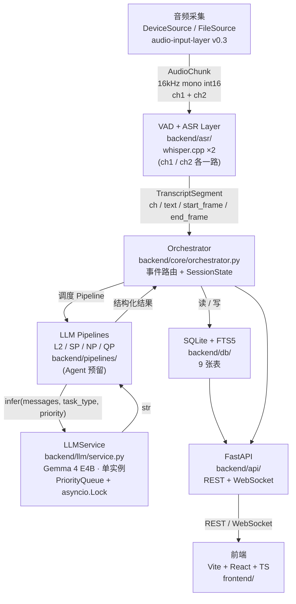
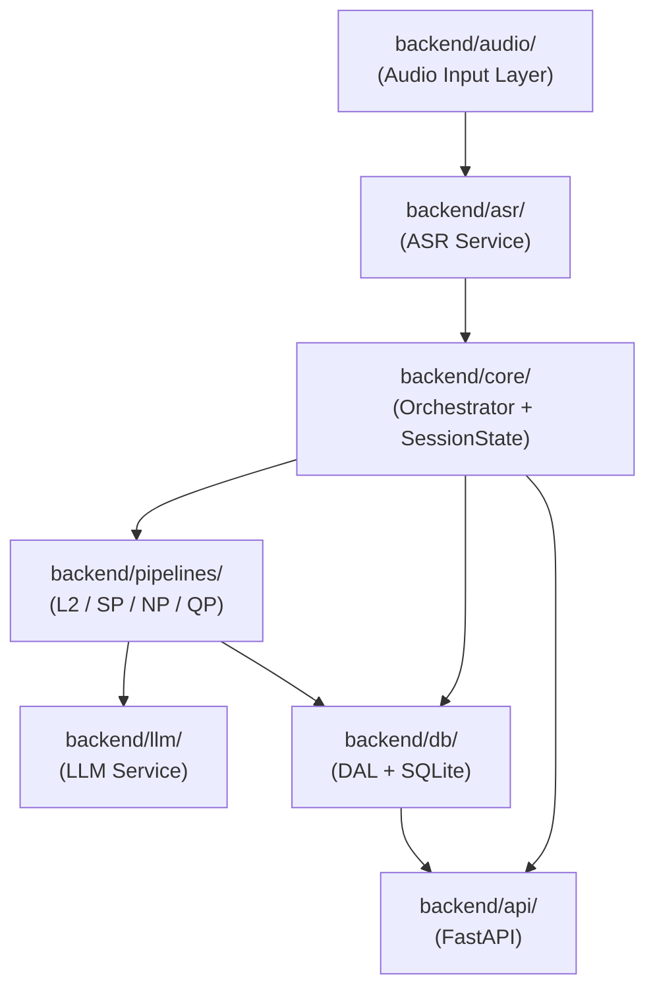

# Spec: 系统整体架构

版本：v0.1（草稿，待 mockup 同步定稿）
日期：2026-05-26
状态：草稿

依赖 spec：
- audio-input-layer v0.3（`docs/specs/2026-05-20-audio-input-layer.md`）
- onset-llm-ux v1.1（`docs/specs/2026-05-22-onset-llm-ux.md`）
- llm-service-design v1.0（`docs/specs/2026-05-25-llm-service-design.md`）

覆盖范围：在三份已有 spec 之上整合、补齐 Orchestrator / SessionState / 前端结构 / 前后端协议 / 9 表 schema 范围 / 模块 ownership 与目录布局。不重复已有 spec 的内容，引用即可。

---

## 1. 背景与覆盖范围

三份已有 spec 各自覆盖了流水线的一段，但留有契约缺口：

- 谁衔接 ASR 输出与 LLM Pipeline？——> 本 spec 定义 Orchestrator。
- SessionState 存什么、在哪维护？——> 本 spec 定义。
- 前端用什么栈、什么路由结构？——> 本 spec 定义（B8 决议）。
- 前后端用什么协议？——> 本 spec 定义 REST 端点表与 WebSocket topic 表。
- SQLite 建哪些表？——> 本 spec 给出 9 表范围，字段细节留 backend-agent。

本 spec 不重复三份上游 spec 的内容。引用上游 spec 时，以「→ 见 onset-llm-ux v1.1 用例 N」或「→ 见 audio-input-layer v0.3 第 M 节」形式标注。

**声道命名约定（全项目统一）**：

对外契约（WS topic、REST 响应、前端 store）统一用一基命名 `ch1 / ch2`，其中 ch1 = audio-input-layer 的 `channels[0]`，ch2 = `channels[1]`。ch1 对应对白通道（Boom / Lav 信号），ch2 对应录音师备注通道。audio-input-layer 内部保持 `channels[i]` 零基访问，两者的映射关系由 Orchestrator 在消费 AudioChunk 时做对应（`channels[0]` → ch1，`channels[1]` → ch2）。

---

## 2. 架构总览



---

## 3. 后端模块边界与 ownership

| 模块 | 路径 | Ownership | 状态 | 主要文件 | 对外接口 |
|---|---|---|---|---|---|
| Audio Input Layer | `backend/audio/` | backend-asr | 已实现 | `source.py` / `device_source.py` / `file_source.py` / `channel.py` | `AudioSource`（迭代器），产出 `AudioChunk` |
| ASR Service | `backend/asr/` | backend-asr | 待实现 | `service.py` / `vad.py` | `ASRService`（见第 7 节） |
| Core（Orchestrator + SessionState） | `backend/core/` | backend-agent | 待实现 | `orchestrator.py` / `session.py` / `events.py` | `Orchestrator`（见第 4 节） |
| LLM Pipelines | `backend/pipelines/` | backend-agent | 待实现 | `l2_take.py` / `sp_parse.py` / `np_note.py` / `qp_query.py` | 各 Pipeline 被 Orchestrator 调用 |
| LLM Service | `backend/llm/` | backend-agent | 待实现 | `service.py` / `config.py` / `client.py` | `LLMService.infer()`（见第 6 节） |
| 数据层 | `backend/db/` | backend-agent | 待实现 | `schema.sql` / `dal.py` / `migrations/` | `DAL`（见第 8 节） |
| API 层 | `backend/api/` | backend-agent | 待实现 | `app.py` / `routes/` / `ws.py` | FastAPI REST + WebSocket（见第 10 节） |
| 测试 | `backend/tests/` | quality | 部分已有 | `test_*.py` / `fixtures/` | 无对外接口 |

---

## 4. Orchestrator 与 SessionState

### 职责

Orchestrator 是后端中枢。它的唯一责任是：接收上游事件，根据 SessionState 决策，调度下游 Pipeline 或写入数据库。不做任何 LLM 推理，不做任何音频处理。

### SessionState

`SessionState` 保存一次录音会话的运行时上下文，由 Orchestrator 持有，单 session 单实例。

| 字段 | 类型 | 说明 |
|---|---|---|
| `scene_id` | `int \| None` | 当前场次数据库 ID |
| `shot` | `str \| None` | 当前镜次编号 |
| `take_id` | `int \| None` | 当前 take 数据库 ID，take 未开始时为 None |
| `take_number` | `int` | 当前场次第几条，从 1 起 |
| `take_active` | `bool` | take 是否进行中 |
| `take_start_ts` | `float \| None` | take 开始的 Unix 时间戳 |
| `script_loaded` | `bool` | 是否已加载剧本 |
| `ch2_buffer` | `list[str]` | 当前 take 内 ch2 原始转录片段（用于 NP 拼接） |
| `active_connections` | `set[str]` | 当前 WebSocket 连接 ID 集合 |

字段说明：

- `take_active` 驱动事件路由。take 开始前，ASR 转录结果只做流式推送，不触发 L2/NP。
- `ch2_buffer` 在 take 结束时作为整体送入 NP Pipeline 解析，解析完清空。
- `active_connections` 供 Orchestrator 向指定连接发 QP 回包（见 10.2 节）。

### 事件路由

Orchestrator 响应以下内部事件（由 ASRService 或前端 API 触发）：

| 事件 | 触发方 | Orchestrator 动作 |
|---|---|---|
| `asr.partial` (ch1) | ASRService | 通过 API 层推送 WS topic `asr.partial.ch1` |
| `asr.final` (ch1) | ASRService | 写 `transcript_segments`；推送 `asr.final.ch1` |
| `asr.partial` (ch2) | ASRService | 推送 `asr.partial.ch2`（录音师自看） |
| `asr.final` (ch2) | ASRService | 追加 `ch2_buffer` |
| `take.start` | 前端 / API | 建 take 行，设 `take_active=True`，更新 SessionState |
| `take.end` | 前端 / API | 触发 L2 + NP；推送 `take.changed` |
| `manual.mark` | 前端 | 写 `take_events`；推送 `take.changed` |
| `query.request` | 前端（QP） | 调度 QP Pipeline；回包走 `qp.answer.{conn_id}` |
| `script.upload` | 前端 / API | 触发 SP Pipeline，结果写 `scripts` + `script_lines` |

### 上下文注入

调度 Pipeline 前，Orchestrator 负责从 SessionState + 数据库拼好 context，Pipeline 本身不直接访问 SessionState 或数据库。

### QP messages 归属

QP（Query Pipeline）的多轮对话 messages 历史由 QP Pipeline 自己维护（每次 query 独立 session）；Orchestrator 不持有 QP 历史。

---

## 5. LLM Pipelines 清单

**B1 决议**：取消独立 L1 Pipeline。原 L1（per-segment 清洗/解析）的职责并入 L2，L2 在 take 结束后对当次 take 的所有 ch1 片段做整合处理。实时段不走 LLM，直接推流。

此变更意味着 llm-service-design v1.0 的 `TASK_CONFIG["l1_clean"]` 条目需删除，LLM Service spec 修订见第 6 节。

**B2 决议**：Agent Pipeline 预留接口，MVP 不实现。

现行 Pipeline 清单：

| Pipeline | task_type（TASK_CONFIG key） | 优先级 | 调用时机 | 输入 | 输出 |
|---|---|---|---|---|---|
| L2 | `l2_take` | P2 | take 结束 | ch1 全部转录片段 + SessionState 上下文 + 剧本（若有） | 结构化 take 记录（status / script_diff / notes 汇总） |
| SP | `script_parse` | P3 | 剧本上传后一次性 | 剧本原文 | `script_lines` 结构化行 + FTS5 索引写入 |
| NP | `note_struct` | P2 | take 结束 | `ch2_buffer` 拼接文本 | 结构化字段（status / performer_issues / audio_quality） |
| QP | `query_session` | P1 | 用户发起查询 | 用户 query 文本 + 数据库检索结果 | 自然语言回答 |
| Agent | （预留） | P3 | MVP 不实现 | — | — |

用例详细描述见 onset-llm-ux v1.1 第「核心 LLM 用例」节。

---

## 6. LLM Service 接口（衔接 llm-service-design v1.0）

llm-service-design v1.0 已定义 PriorityQueue + asyncio.Lock 架构、单例模式、asyncio.to_thread 包裹推理。本 spec 在此基础上修订两处：

**修订 1（B4 决议）：接口从 `prompt: str` 改为 `messages: list`**

```
# 修订后签名
async def infer(
    self,
    messages: list[dict],   # 原为 prompt: str
    task_type: str,
    priority: int = 2,
    timeout: float = 30.0,
) -> str
```

`messages` 格式为标准 `[{"role": "...", "content": "..."}]` 列表，支持直接传 audio 或 image content 块（原生多模态）。底层 dispatcher 判断当前推理后端能否直接处理 audio content：能则直吃；不能则先调 ASRService 转文再拼回 text 块。

**修订 2（B2 决议）：Agent Pipeline 在 TASK_CONFIG 中保留条目但标注预留**

```
TASK_CONFIG = {
    ...
    "agent_init": {"_reserved": True, ...},  # MVP 不实现，接口预留
}
```

**修订 3（B1 决议）：删除 `l1_clean` 条目**

llm-service-design v1.0 的 `TASK_CONFIG["l1_clean"]` 删除，对应 `l1_segment.py` Pipeline 文件不建。

这三处修订需 backend-agent 同步升版 llm-service-design spec 到 v1.1（TODO，见第 14 节）。

---

## 7. ASR Service

### 整体方案

VAD + whisper.cpp 双路并行，每路独立处理。决策依据见 onset-llm-ux v1.1「ASR 引擎选型」节。

- VAD：按声道切语音段（SpeechSegment），加 pre/post roll，不传无声段给 ASR 以节省推理资源。
- whisper.cpp：每路一个独立实例（ch1 / ch2）。
- ASR 结果带 `start_frame` / `end_frame`（来自上游 SpeechSegment），供时间对齐与 take 记录。

### Python 集成方式

whisper.cpp 在 Python 中的绑定方式有多个候选（pywhispercpp / whisper-cpp-python / subprocess / faster-whisper 兜底）。

**TODO（backend-asr）**：起 30 分钟 spike，确认各方式在当前环境的可行性，写结论到实验 README，结论另留痕 `docs/` 或 Notion。确认后钉死，写入 ASR Service 自己的 spec。

### 接口

ASRService 暴露两个接口（最终签名由 backend-asr spike 后定，以下为草案）：

**主链路**（Orchestrator 调用，上游已经过 VAD 切段）：

```
ASRService.transcribe(segment: SpeechSegment) -> TranscriptSegment
```

**Dispatcher 退路**（LLMService dispatcher 在需要 ASR fallback 时调用）：

```
ASRService.transcribe_raw(audio: np.ndarray, sample_rate: int = 16000) -> str
```

**TODO（backend-asr）**：spike 完成后在 ASR Service 独立 spec 中最终确认签名。

`TranscriptSegment` 字段（草案）：

| 字段 | 类型 | 说明 |
|---|---|---|
| `ch` | `int` | 声道（1 或 2，一基命名） |
| `text` | `str` | 转录文本 |
| `start_frame` | `int` | 语音段首帧（16kHz 基准） |
| `end_frame` | `int` | 语音段末帧 |
| `is_partial` | `bool` | 是否为中间片段（流式推送用） |

---

## 8. 数据层（SQLite + FTS5）

**B7 决议**：9 张表全量建，不分期缩减。

9 张表范围：

| 表 | 用途 |
|---|---|
| `scenes` | 场次（scene_id / 场次编号 / 描述 / 日期等） |
| `takes` | take 记录（scene_id / take_number / 起止时间戳 / status 等） |
| `take_events` | take 内手动 mark 及 NP 写入的结构化事件 |
| `scripts` | 已上传剧本（scene_id / 原文 / 上传时间） |
| `audit_log` | 所有写操作审计日志 |
| `active_observers` | 当前 /view 连接（connection_id / name / 接入时间） |
| `transcript_segments` | ch1/ch2 转录片段（take_id / ch / text / start_frame / end_frame） |
| `script_lines` | SP Pipeline 解析出的剧本行（scripts_id / 行号 / 台词 / 角色），含 FTS5 索引 |
| `take_line_matches` | take 转录与剧本行的比对结果（take_id / line_id / diff_type） |

**每张表的字段细节及 schema 由 backend-agent 起独立 schema spec**（见第 14 节 TODO）。

数据层对外通过 `backend/db/dal.py` 的 DAL（Data Access Layer）类访问，Orchestrator 和 API 层不直接拼 SQL。schema 和迁移脚本进 git（`backend/db/schema.sql` / `backend/db/migrations/`）；`*.db` 运行库不进 git。

---

## 9. 前端结构

**B8 决议汇总**：

- **技术栈（B8a）**：Vite + React + TypeScript + shadcn（Radix UI base）+ pnpm。
- **路由结构（B8b）**：单 App 双路由，`/admin`（录音师主界面，需鉴权）和 `/view`（导演 / 场记只读，填名字进入）。
- **状态管理（B8f）**：TanStack Query 管理服务端数据（takes / scenes / scripts）；Zustand 管理 UI 状态（侧栏开关 / 当前选中 take 等）。WebSocket 推送直接写入 `queryClient.setQueryData`，保持数据源统一。

目录布局建议：

```
frontend/
  src/
    routes/
      admin/          # /admin 路由相关页面
      view/           # /view 路由相关页面
    components/
      shared/         # admin 与 view 共用组件
    lib/
      api/            # REST 请求封装
      ws/             # WebSocket 连接管理，负责 setQueryData
    stores/           # Zustand store
  package.json
  vite.config.ts
```

前端命令（待补充，前端技术栈确认后由 Lead 补入 CLAUDE.md）。

---

## 10. 前后端协议

### 10.1 REST 端点表

所有端点 base path 为 `/api/v1`。

| Method | Path | 说明 | 鉴权 |
|---|---|---|---|
| GET | `/takes` | 取 take 列表，支持 `scene_id` 过滤 | 无 |
| GET | `/takes/{id}` | 取单条 take 完整记录 | 无 |
| PATCH | `/takes/{id}` | 更新 take（手动 mark / 补 note） | ADMIN |
| GET | `/notes` | 取 note 列表，支持 `take_id` 过滤 | 无 |
| POST | `/notes` | 追加候补 note（触发 NP Pipeline） | ADMIN |
| GET | `/scripts` | 取已上传剧本列表 | 无 |
| POST | `/scripts` | 上传剧本文本（触发 SP Pipeline） | ADMIN |
| GET | `/scenes` | 取场次列表 | 无 |
| POST | `/scenes` | 新建场次 | ADMIN |
| PATCH | `/scenes/{id}` | 更新当前活跃场次 | ADMIN |
| POST | `/query` | 发起自然语言查询（QP Pipeline） | 无 |
| GET | `/export/takes` | 导出场记单（JSON / PDF，格式由 query param 指定） | 无 |
| POST | `/take/start` | 手动触发 take 开始（写 SessionState） | ADMIN |
| POST | `/take/end` | 手动触发 take 结束（触发 L2 + NP） | ADMIN |

请求体与响应 schema 由 backend-agent 与前端对齐后定义（TODO）。

### 10.2 WebSocket Topic 表

WS 连接端点：`/ws`，连接时 query string 带鉴权信息（见 10.3 节）。

| Topic | 发布时机 | 负载（草案） | 谁订阅 |
|---|---|---|---|
| `asr.partial.ch1` | ch1 ASR 实时片段产出 | `{text, start_frame, take_id}` | /view 实时显示 |
| `asr.partial.ch2` | ch2 ASR 实时片段产出 | `{text, start_frame}` | /admin 录音师自看 |
| `asr.final.ch1` | ch1 本段转录最终确认 | `{text, start_frame, end_frame, take_id}` | /admin + /view |
| `asr.final.ch2` | ch2 本段转录最终确认 | `{text, start_frame, end_frame}` | /admin |
| `take.changed` | take 状态变化（开始 / 结束 / mark / Pipeline 写入） | `{take_id, take_number, status, scene_id}` | /admin + /view |
| `presence` | 有新 /view 连接加入或断开 | `{connection_id, name, action}` | /admin（录音师看谁在线） |
| `qp.answer.{conn_id}` | QP Pipeline 完成 | `{query, answer, take_refs}` | 发起查询的连接 |

负载 schema 由 backend-agent 与前端对齐后定义（TODO）。

### 10.3 鉴权

- **`/admin` 路由 + ADMIN 端点**：需要 `ADMIN_TOKEN`，写 `.env`，后端启动时控制台打印（方便 hackathon 现场找 token）。REST 请求通过 `Authorization: Bearer <token>` 头传入；WS 连接在 query string 带 `?token=<token>`。
- **`/view` 路由**：进入时输入名字，前端向 POST `/view/register` 换取 `connection_id`，后续 WS 连接 query string 带 `?name=<name>&conn_id=<connection_id>`。`active_observers` 表记录在线状态。
- 无用户体系，无持久化 token，重启清空 `active_observers`。

---

## 11. 模块依赖关系



依赖方向单向。`backend/audio/` 不依赖任何其他后端模块，`backend/llm/` 不依赖 `backend/db/`（Pipeline 自己决定什么结果写库）。

---

## 12. 与已有 spec 的衔接点

### audio-input-layer v0.3

本 spec 不重复 `AudioChunk` / `AudioConfig` / `AudioSource` 定义，直接引用该 spec 第 5 节。

衔接点：Orchestrator 消费 ASRService 的 `TranscriptSegment`，ASRService 的上游链路是 `AudioChunk → VAD → SpeechSegment → whisper.cpp`，最终链接到 audio-input-layer 的输出。Orchestrator 不直接消费 `AudioChunk`。

需同步更新（见第 13 节）：该 spec 第 1、4 节中「直接下游是 ASR 的 Cactus 引擎」描述需改为「whisper.cpp」；第 13 节引用的 `cactus-asr-probe` 实验需注明「仅作历史参考，当前 ASR 引擎改为 whisper.cpp，见 onset-llm-ux v1.1」。

### onset-llm-ux v1.1

本 spec 不重复 LLM 用例描述，引用其用例编号（用例 1 = 口述备注结构化，用例 2 = 候补 note，用例 3 = 脚本偏差检测，用例 4 = take 对比摘要，用例 5 = 语义化查找，用例 6 = 剧本语义检索）。

衔接点：onset-llm-ux v1.1 里的 UX 流程图保留了独立的 L1 节点，需删除（见第 13 节）。

### llm-service-design v1.0

本 spec 在第 6 节对 llm-service-design v1.0 做了三处修订：

1. `prompt: str` → `messages: list`（B4 决议）。
2. 删除 `TASK_CONFIG["l1_clean"]`（B1 决议）。
3. `agent_init` 标注预留（B2 决议）。

backend-agent 需将这三处修订正式写入 llm-service-design v1.1（TODO，见第 14 节）。

---

## 13. 上游文档需同步更新

| 文档 | 改动 |
|---|---|
| `CLAUDE.md` 架构图 | Cactus ASR → whisper.cpp；删「take 边界检测」节点；架构图加 Orchestrator 层 |
| `CLAUDE.md` 四个模块契约第 1、2 条 | 「Cactus ASR 产出」→ 「whisper.cpp 产出」；ownership 表 `backend-asr` 职责删「take 边界检测」 |
| `CLAUDE.md` ownership 表 | 加 `backend/core/`（backend-agent 职责）一行 |
| `docs/structure.md` | `backend/` 描述中 Cactus ASR → whisper.cpp；删「take 边界检测」；`models/` 行 Cactus 权重 → whisper.cpp + Gemma 4 E4B 权重 |
| `docs/specs/2026-05-20-audio-input-layer.md` | 第 1、4 节「直接下游」ASR 引擎名称注明；第 13 节 cactus-asr-probe 引用加「历史参考」注 |
| `docs/specs/2026-05-22-onset-llm-ux.md` | UX 流程图删独立 L1 节点；L1 Pipeline 字段说明 |
| `docs/specs/2026-05-25-llm-service-design.md` | 升版为 v1.1，落地三处修订（见第 6 节）|
| AI-UX Notion 第一张流程图 | 删独立 L1 节点（Lead 协调） |

---

## 14. 待定 / TODO

| 项目 | 负责 | 说明 |
|---|---|---|
| whisper.cpp Python 集成方式 spike | backend-asr | 30 分钟 spike，确认绑定方式，结论留痕 |
| ASR Service 独立 spec | backend-asr | spike 完成后输出，含 `TranscriptSegment` 最终字段与接口签名 |
| 9 表 schema 细节 spec | backend-agent | 每张表的字段、约束、索引；FTS5 配置 |
| REST 请求体 / 响应 schema | backend-agent + 前端 | 接口对齐后补入本 spec 或独立 API spec |
| WebSocket 负载 schema | backend-agent + 前端 | 同上 |
| llm-service-design 升版 v1.1 | backend-agent | 落地第 6 节三处修订 |
| 前端技术栈命令补入 CLAUDE.md | Lead | 前端初始化后补 `pnpm dev` 等命令 |
| 页面布局 mockup | Lead（主线） | 独立确认，不阻塞 spec 定稿 |

---

## 15. 开放问题

1. **声道编号对外一基（ch1/ch2）已在本 spec 采用**，但 audio-input-layer v0.3 第 4-5 节、前端 store、WS topic 三处命名历史上不一致。需 Lead 在评审时拍板，并统一通知 backend-asr 同步更新 audio-input-layer spec。

2. **L2 batching 参数**：L1 删除后，原先讨论的 micro-chunk batching 参数（窗口 1.5–3s / 30–150 tok / 静音 700–1200ms）是否还有意义？若 L2 是每 take 一次性整合，batching 参数对 L2 不适用。建议实现时再评估，本 spec 暂不锁定。

3. **Gemma 4 E4B 本地推理后端**：llama-cpp-python / mlx-vlm / Ollama 哪个最适合（影响多模态 audio content 支持和 asyncio.to_thread 集成方式）。需 backend-agent 起 spike，结论影响 llm-service-design v1.1 的「底层模型加载」小节。

4. **ch2 取用策略**：onset-llm-ux v1.1 开放问题第 1 条（ch2 独立物理麦 vs 录音机通话键 PTT）尚未决策，影响 ASR Service 的 VAD 策略（PTT 可省 VAD）。本 spec 暂按「始终有 VAD」处理，确认后再调整。

5. **take 边界触发**：onset-llm-ux v1.1 开放问题第 2 条（手动触发 vs 自动检测 Cut 信号）尚未决策。本 spec 的 REST 端点 `POST /take/start` 和 `POST /take/end` 按手动触发设计，自动检测作为未来扩展。
