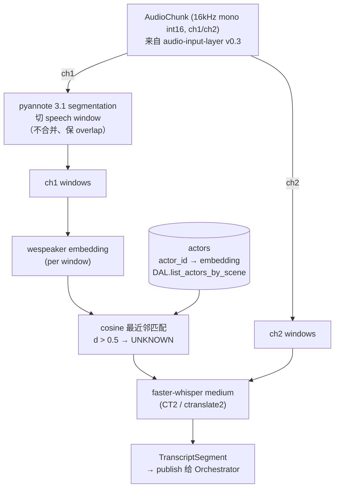

# Spec: ASR Service（含 speaker diarization 与 enrollment）

版本：v0.1（草稿，待 Lead + 境熙评审）
日期：2026-05-28
状态：草稿
owner：经纬

变更记录：

- v0.2（2026-06-03）：实现回写。ASR 引擎实际落地为 **whisper.cpp（via pywhispercpp，权重 `models/whisper/ggml-medium.bin`）**，非本 spec v0.1 §3 选定的 faster-whisper —— 理由与流式接入形态见 `2026-06-02-realtime-diarization-voicenote-design.md` §5.2。§3 的 faster-whisper 选型与性能数据保留为 0.G spike 历史结论 / 背景，不再代表生产实现。运行环境为 Python 3.12。
- v0.1（2026-05-28）：初稿。基于 0.G spike 结论（`experiments/2026-05-27-speaker-diarization/`）落定。enrollment-based 架构、faster-whisper 选型、pyannote 3.1 segmentation/embedding 一并钉死。

依赖 spec（按权威级别排序）：

1. system-architecture v0.1（`docs/specs/2026-05-26-system-architecture.md`）
2. sqlite-schema v0.2（`docs/specs/2026-05-27-sqlite-schema.md`）
3. development-plan v0.2（`docs/specs/2026-05-27-development-plan.md`）
4. audio-input-layer v0.3（`docs/specs/2026-05-20-audio-input-layer.md`）
5. onset-llm-ux v1.1（`docs/specs/2026-05-22-onset-llm-ux.md`）

覆盖范围：dev-plan §5 0.B ticket 范围 —— `TranscriptSegment` 最终字段、`ASRService` 接口签名、ASR 引擎选型、VAD 与 diarization 路径、speaker 标签生成方式、与 Orchestrator 的事件 publish 协议（contract C1）。

不覆盖：DAL 实现（C2 在 sqlite-schema spec / 1.D ticket）、Orchestrator 内部状态机（C3 在 1.E ticket）、FastAPI 端点（1.I ticket）。

**重要前提**：本 spec 与 system-architecture v0.1 §7 已有的 ASR 草案有几处偏离，原因是 0.G spike 反证。偏离明列在第 12 节，需 Lead 批准后回写上游 spec。

---

## 1. 背景与决策依据

0.G spike 试遍三条 speaker 标签路径：

| 路径 | 结论 | script |
|---|---|---|
| WhisperX 默认：whisper-first → 段级 speaker 合并 | 段太长跨多人，长段内插话被淹没 | `01_whisperx_hello.py` |
| Diarize-first → 每 turn 独立转录 | 同性别近音色（两男）的 unsupervised 聚类抖动 | `02_diarize_first.py` |
| **Enrollment-based**：演员声纹锚点 + 最近邻匹配 | ✅ 三人正确分离，插话独立捕捉 | `03_enrollment_id.py` |

数据：test_long.wav 287s / 三人访谈（两男一女）→ 90 turn，三人全部正确分离，端到端 RTF 0.082（≈12x 实时）。

详细数据与对比留痕在 `experiments/2026-05-27-speaker-diarization/README.md`。

---

## 2. 整体架构



**关键约束**：

- ch1（对白通道）走完整 enrollment 匹配链路
- ch2（录音师备注通道）跳过 diarization 与 embedding，直接走 ASR，`speaker` 永远为 `None`
- pyannote 模型一份实例，由 ch1 链路独占；ch2 用 faster-whisper 自带的简易 VAD 即可

---

## 3. ASR 引擎选型：faster-whisper（via WhisperX）

> **⚠ 已被实现取代（v0.2）**：生产实现改为 **whisper.cpp（via pywhispercpp）**，权重 `ggml-medium.bin`，封装见 `backend/asr/whisper_runner.py`。本节以下 faster-whisper / WhisperX 的选型论证与性能数字是 0.G spike 的历史结论，保留作背景。切换理由（流式段级接入、in-process、依赖更轻）见 `2026-06-02-realtime-diarization-voicenote-design.md` §5.2。

**实际选 faster-whisper（CT2 后端）**，**不是** system-architecture v0.1 §7 提到的 whisper.cpp。

**理由**：

- 0.G spike 全程基于 WhisperX 3.4.2，内部 ASR 后端是 faster-whisper 1.2.1 + ctranslate2 4.4
- 与 whisper.cpp 等价（同一 whisper-medium 模型权重），但 Python 集成更成熟
- Windows 跨平台 wheel 现成，依赖矩阵已钉死跑通

**已知性能**（RTX 3060 Ti / CUDA 12.4 / cuDNN 8.9.7.29 / Windows 11）：

- 加载：首次 31.67s（含模型权重下载），缓存命中 ~2.5s
- ASR 推理：medium 模型，FP16，per-turn RTF ≈ 0.024
- 与 pyannote segmentation 一起跑：端到端 RTF ≈ 0.082 on 287s 多 speaker 音频

**选 medium 而不是 large-v3 的理由**：medium 中文质量已够 spike 验收，且 4GB VRAM / RTF 0.024 留足头部空间给同机其他模型（Gemma 4 E4B 推理）。large-v3 留作 1.B 验收后视情升级。

**未走 0.A spike**：dev-plan §5 原列的 whisper.cpp Python 集成 spike（0.A，候选 pywhispercpp / whisper-cpp-python / subprocess）**没跑**。本 spec 直接锁定 faster-whisper。若未来真要切回 whisper.cpp，独立起 ticket 重新评估，本 spec 不阻塞。

---

## 4. VAD / Segmentation：pyannote 3.1 内置

**沿用 pyannote/segmentation-3.0**（pyannote/speaker-diarization-3.1 pipeline 内部用的同款）。

理由：

- pyannote pipeline 已包含 segmentation，无需独立 VAD 层
- ctranslate2 / faster-whisper 自带的简易 VAD 用于 ch2（无需精细 turn 切分）
- 一套依赖一套调参

参数（基于 0.G spike）：

- `min_turn_s = 0.3`：过滤 <0.3 秒的窗口（embedding 抽不稳）
- 不合并相邻原始窗口：保留 overlap，让插话独立成 turn
- segmentation 内部默认 threshold（pyannote 3.1 已调优）

---

## 5. Speaker Enrollment：核心数据结构与算法

### 5.1 锚点存储

每个 actor 一个 256 维 float32 embedding，由 `pyannote/wespeaker-voxceleb-resnet34-LM` 模型在场前录入时提取。

存储位置：DAL.actors 表（详见第 9 节 contract C2）。

### 5.2 enrollment 长度约束

**enrollment 音频长度强制 ≥ 10 秒，推荐 15-20 秒**。

数据依据（来自 04 诊断脚本）：

| enrollment 长度 | intra-speaker (同人内部抖动) | inter-speaker (不同人之间) | 比值 |
|---|---|---|---|
| 3-4.5 秒（短样本） | 0.33-0.42 | 0.80-1.04 | 2-3x（不稳） |
| 17-19 秒（长样本） | 0.09-0.15 | 0.81-1.05 | **6-12x**（稳） |

短样本 intra 抖动跟 unknown threshold（0.5）接近，会导致匹配漂移；长样本 intra ≪ inter，分离干净。

### 5.3 匹配算法

每个 speech window 流程：

1. 从 audio[start_frame:end_frame] 抽 embedding e（256 dim）
2. 对当前 scene 所有 actor 的锚点 a_i 算 cosine distance `d_i = 1 - cos(e, a_i)`
3. 取最小 d_i 的 actor_id 作为标签
4. 若所有 d_i > 0.5（unknown threshold），标 `"UNKNOWN"`

```python
def assign_speaker(emb: np.ndarray, anchors: dict[str, np.ndarray]) -> tuple[str, float]:
    distances = {aid: cosine_distance(emb, a) for aid, a in anchors.items()}
    best_id, best_d = min(distances.items(), key=lambda kv: kv[1])
    if best_d > 0.5:
        return "UNKNOWN", best_d
    return best_id, best_d
```

### 5.4 unknown 阈值

`unknown_threshold = 0.5` cosine distance。基于 spike 实测：

- 22 个 UNKNOWN turn 全是 <1.5s 的助词 / 笑声（嗯 / 啊 / 對吧）
- 0.5 阈值不会把任何长 turn 误标为 UNKNOWN（spike 数据中长 turn 最差 d 也是 0.49 仍正确归人）
- 后续若误报 UNKNOWN 过多，调到 0.6 也可（但开放上限到 0.7，超出说明 embedding 模型对当前 scene 演员就分不开了）

### 5.5 多 enrollment 样本（开放问题）

当前每个 actor 一份 embedding 锚点。生产可能需要多份（不同情绪、不同距麦距离）求均值。本 spec 暂不支持，1.B 实现后视质量决定。

---

## 6. Window 策略与后处理

### 6.1 不合并 raw window

pyannote 3.1 输出含 speaker turn 边界与 overlap，**不要在 ASR 层合并**：

- 测试 test_long.wav：108 raw → 90 通过 `min_turn_s=0.3` 过滤
- 合并会把跨 speaker 的 turn 缩成大窗，embedding 平均后丢失插话信息
- 留 overlap 给前端层决定展示策略（侧栏 timeline 标记 / 重叠箭头）

### 6.2 UNKNOWN 短窗过滤（默认开启）

UI / 导出层默认丢弃符合两条件的 turn：

```python
if seg.speaker == "UNKNOWN" and seg.duration_s < 1.5:
    drop()
```

JSON / 数据库仍保留（审计用）。导出场记单 / WS 推流默认丢。配置项 `noise_filter_enabled` 默认 True，关掉则全保留。

理由：test_long.wav 实测 22 个 UNKNOWN 全是助词 / 笑声，场记单上是噪声。

### 6.3 简繁混杂与无标点

**已知 artifact，列入开放问题，不阻塞 1.A/1.B**：

- whisper medium 中文输出会简繁混杂（罗湘 / 假裝 同句）
- 原生无标点

解决路径（独立 ticket）：

- 后处理：OpenCC `zh-Hans` 转换 + funasr/ct-punc 标点恢复
- 或换 whisper large-v3：精度↑，RTF 0.024 → 0.05-0.10（仍超实时）

由 1.B 验收后决策。

---

## 7. TranscriptSegment 数据类（最终）

```python
from dataclasses import dataclass

@dataclass(frozen=True)
class TranscriptSegment:
    """ASR Service → Orchestrator 的事件 payload（contract C1）。"""
    ch: int                    # 声道：1 (对白) 或 2 (录音师备注)
    speaker: str | None        # actor_id (如 "lq" / "actor_42")；
                               # "UNKNOWN" 字面值表示匹配不到；
                               # ch2 永远 None
    text: str                  # 转录文本
    start_frame: int           # 16kHz 帧计数，session 起点累计
                               # 与 audio-input-layer AudioChunk.start_frame 同基
    end_frame: int             # 同上
    is_partial: bool           # WS partial 流式 vs final 确认
    confidence: float | None   # cosine distance（0.0 = 完美匹配，1.0 = 正交）
                               # ch2 / UNKNOWN / is_partial 都为 None
```

**与 sqlite-schema v0.2 §2.7 `transcript_segments` 表字段映射**：

| TranscriptSegment 字段 | DB 列 | 备注 |
|---|---|---|
| ch | ch | INTEGER CHECK IN (1,2) |
| speaker | speaker | TEXT NULL；可空表 ch2 / partial 不写库 |
| text | text | TEXT NOT NULL |
| start_frame | start_frame | INTEGER |
| end_frame | end_frame | INTEGER |
| is_partial | （不入库） | partial 仅 WS 推送，per sqlite-schema 评审决议 |
| confidence | (建议新增 `confidence REAL NULL`) | 给 1.D ticket 新增列 |

**对 dev-plan §8 contract C1 的影响**：字段名稳定（`speaker: str | None`），语义升级。新增 `confidence` 字段。

---

## 8. ASRService 接口

```python
from typing import Awaitable
import numpy as np

class ASRService:
    """ch1 / ch2 共享一组模型，但 ch1 走 enrollment，ch2 不走。"""

    def __init__(self, config: ASRConfig, dal: DAL) -> None:
        self._config = config
        self._dal = dal
        # 模型实例延后到 warmup 加载

    async def warmup(self) -> None:
        """启动时调用一次。
        - 加载 faster-whisper medium 模型
        - 加载 pyannote 3.1 diarization pipeline（含 segmentation + embedding 子模型）
        - 加载 wespeaker embedding 模型（独立，用于 enrollment 抽锚点）
        - 首次 ~120s（含 HF 下载），缓存命中 ~10s
        """

    async def enroll(
        self,
        actor_id: str,
        scene_id: int,
        audio: np.ndarray,
        sample_rate: int = 16000,
    ) -> EnrollmentResult:
        """录入演员声纹。
        - audio 推荐 ≥15s clean monologue（短于 10s 拒绝并报错）
        - 内部抽 embedding，写 DAL.actors（upsert 按 actor_id）
        - 返回锚点元信息（embedding shape / 与已有 actor 的距离矩阵）供前端审核
        """

    async def transcribe_speech_segment(
        self,
        ch: int,
        segment: SpeechSegment,
        take_id: int | None,
        scene_id: int,
    ) -> list[TranscriptSegment]:
        """主链路：从 audio-input-layer / VAD 上游 SpeechSegment 转 TranscriptSegment。
        - ch=1：走 pyannote 切窗 + enrollment 匹配 + 每窗 whisper
        - ch=2：直接 faster-whisper，speaker 字段固定 None
        - 上游若已切好 turn，scene_id 用于过滤 actor 范围
        """

    async def transcribe_raw(
        self,
        audio: np.ndarray,
        sample_rate: int = 16000,
    ) -> str:
        """退路：LLMService dispatcher 给 audio content 块时调，无 speaker，无 turn 切分。
        per system-architecture v0.1 §7。
        """
```

`ASRConfig` 字段：

```python
@dataclass(frozen=True)
class ASRConfig:
    model_size: str = "medium"           # whisper 大小
    language: str = "zh"
    device: str = "cuda"                 # 或 "cpu"
    compute_type: str = "float16"        # GPU；CPU 用 "int8"
    min_turn_s: float = 0.3
    unknown_threshold: float = 0.5
    noise_filter_enabled: bool = True    # UNKNOWN 短窗过滤
    noise_filter_max_duration_s: float = 1.5
    enroll_min_duration_s: float = 10.0  # 短于此拒绝
```

---

## 9. 跨人 contract 影响

### Contract C1 升级（dev-plan §8）

字段名不变：`speaker: str | None`。语义升级：

- 旧：`SPEAKER_NN`（pyannote unsupervised cluster id）
- 新：actor_id（来自 DAL.actors，可为人类名 `"lq"` 或数字 `"actor_42"`），或字面 `"UNKNOWN"`

新增 payload 字段：`confidence: float | None`（cosine distance）。

### Contract C2 扩展（sqlite-schema v0.2 §6）

**新增 actors 表**（境熙 1.D 需要加）：

```sql
CREATE TABLE IF NOT EXISTS actors (
    actor_id    TEXT    PRIMARY KEY,           -- 人类名或数字 ID，由前端注册时填
    scene_id    INTEGER NOT NULL
        REFERENCES scenes (scene_id) ON DELETE CASCADE,
    name        TEXT    NOT NULL,              -- 显示名（场记单上显示）
    embedding   BLOB    NOT NULL,              -- 256 维 float32 序列化
    enroll_duration_s REAL NOT NULL,           -- enrollment 音频长度（审计）
    created_at  REAL    NOT NULL DEFAULT (unixepoch('now', 'subsec'))
);

CREATE INDEX IF NOT EXISTS ix_actors_scene_id ON actors (scene_id);
```

**DAL 新增方法**（境熙 1.D）：

```python
def upsert_actor(
    self,
    actor_id: str,
    scene_id: int,
    name: str,
    embedding: bytes,           # numpy.float32.tobytes()
    enroll_duration_s: float,
) -> None: ...

def list_actors_by_scene(self, scene_id: int) -> list[Actor]: ...

def delete_actor(self, actor_id: str) -> None: ...

def get_actor(self, actor_id: str) -> Actor | None: ...
```

**transcript_segments 表新增列**（境熙 1.D，迁移脚本加 v2）：

```sql
ALTER TABLE transcript_segments
    ADD COLUMN confidence REAL NULL;
```

或在 v1_init.sql 里就建好（如 v0.2 schema 仍未实现，可一次到位）。

### Contract C3 / C4 / C5 不受影响

- C3（Orchestrator publish）：消费 C1 payload，自动跟随升级
- C4（LLMService）：无关
- C5（take.changed）：无关

---

## 10. 性能预算与首次启动

### 启动期

- pyannote 3.1 首次下载约 110s（HF 拉模型权重 + segmentation + wespeaker）
- 缓存命中后 1.5s
- faster-whisper medium 首次下载约 30s，缓存命中 2.5s
- wespeaker embedding 模型单独加载 1.6s（首次 / 缓存均）

**warmup 总耗时**：首次 ~150s，缓存命中 ~10s。

### 运行期（per chunk）

- ch1 一个 5s SpeechSegment：~0.5s 端到端（含 pyannote 切窗 + per-window embedding + per-window whisper）
- ch2 一个 5s SpeechSegment：~0.15s（仅 whisper）
- 总 RTF（含 diar + asr，不含 warmup）：0.08-0.10，即 10-12x 实时

### Orchestrator 行为

- `warmup` 未完成前 `POST /api/v1/take/start` 应拒绝（HTTP 503，body `{"reason": "model_loading"}`）
- 健康检查 `/healthz` 在 warmup 完成后才报 ready

---

## 11. 依赖与跨平台

### 11.1 锁版依赖（重要）

WhisperX 上游声明开放上界，pip 直接装会拉到互不兼容的最新版。**1.A 实现时直接 fork 0.G 的 venv**，或严格按下表装：

| 包 | 版本 | 理由 |
|---|---|---|
| torch | 2.5.1+cu124 | torch 2.6+ 触发 torchaudio AudioMetaData 移除 |
| torchaudio | 2.5.1+cu124 | 与 torch 同步 |
| whisperx | 3.4.2 | 锚版本 |
| pyannote.audio | 3.3.2 | 4.x 改了 Inference 签名 |
| transformers | 4.48.3 | 5.x 强制 torch ≥ 2.6 (CVE-2025-32434) |
| huggingface_hub | 0.36.2 | 1.x 移除了 use_auth_token |
| speechbrain | 0.5.16 | 1.x 的 lazy import 在 Windows 触发 k2 缺失 |
| nvidia-cudnn-cu12 | 8.9.7.29 | ctranslate2 < 4.5 依赖 cuDNN 8 DLL |
| omegaconf | 2.3.0 | pyannote 3.x 反序列化必需，但未声明 |

详见 `experiments/2026-05-27-speaker-diarization/requirements.txt`。

### 11.2 跨平台（dev-plan §2 硬约束）

| 平台 | 状态 | 关键点 |
|---|---|---|
| Windows 11 (CUDA 12.4) | ✅ 0.G 验证通过 | cuDNN 8 wheel via pip；PATH 注入 cudnn / cublas bin 目录 |
| macOS (Apple Silicon) | ⏳ 未验证 | Metal 路径不需要 cuDNN；torchaudio 用 Accelerate；需 spike |
| Linux (CUDA) | ⏳ 未验证 | 与 Windows 类似，但 cuDNN DLL 路径不同 |

**dev-plan §2 跨平台一致原则**要求 macOS 也验通过 1.M milestone 才能签收。1.A 实现时务必同时在 macOS 验跑。

### 11.3 HF 模型下载（一次性）

需 HF token + 同意 3 个 gated model：

- `pyannote/speaker-diarization-3.1`
- `pyannote/segmentation-3.0`
- `pyannote/wespeaker-voxceleb-resnet34-LM`

下载后缓存到 `~/.cache/huggingface/`，运行时纯本地，无网络调用。

部署时可预下载 + 打包，或 `HF_HOME` 指到项目内 `models/` 路径。

---

## 12. 与上游 spec 的偏离

本 spec 与上游 spec 几处偏离，需 Lead 批准后回写：

### system-architecture v0.1 §2、§7、§11

- 偏离：ASR 引擎从 "whisper.cpp" → "faster-whisper (via WhisperX, CT2 后端)"
- 影响：架构图节点改名，文字描述同步；不影响接口契约（C1 不变）

### system-architecture v0.1 §7 "TranscriptSegment 草案"

- 字段新增 `confidence: float | None`
- speaker 字段语义升级（actor_id 而非 SPEAKER_NN）

### sqlite-schema v0.2 §2.7 transcript_segments

- 新增 `confidence REAL NULL` 列
- speaker 字段注释升级：值为 actor_id 引用而非自由文本

### sqlite-schema v0.2 第 9 表范围之外

- **新增第 10 张表 actors**（详见第 9 节 C2）

### dev-plan v0.2 §6 1.B 验收口径

- 旧：「ch1 多 speaker 识别，speaker 标签准确率手测达标」
- 新：「ch1 多 actor 识别（含 enrollment 工作流），actor_id 标签准确率手测达标」
- enrollment 工作流前端 / 后端 / 数据层均需要 1.A / 1.B / 1.D 协调

### dev-plan v0.2 §5 0.A spike

- 跳过：不再做 whisper.cpp Python 集成 spike，直接锁定 faster-whisper
- 备注：若未来切回 whisper.cpp，独立起 ticket

### onset-llm-ux v1.1 用例

- **新增用例**：「场前 actor enrollment」—— 录音师让每个演员独立录 15-20s clean 独白
- UI 流程：admin UI 新增 Scene 演员注册面板（前端 1.B 范围内）

### dev-plan §8 contract C1 payload

- 字段名不变，语义升级（详见第 9 节 C1）
- 新增字段：`confidence`

---

## 13. 开放问题

1. **enrollment 多样本均值**：当前每 actor 一份锚点。生产可能需要不同情绪 / 不同距麦距离的多份均值。1.B 实现后视质量决定，开放问题。

2. **simplified / traditional 中文混杂 + 无标点**：whisper medium 通病。1.B 验收后视效果决定是否上 large-v3 或 OpenCC + funasr 后处理（独立 ticket）。

3. **跨 take 的 enrollment 复用**：同一 actor 在多个 scene 出现是否复用锚点？当前 schema 把 actor_id 绑到 scene_id（CASCADE 删），改成 actor 全局 + scene 关联表更灵活。开放问题。

4. **enrollment 失败 / 录音不清晰**：UI 应该有 enrollment 质量反馈（intra-speaker 抖动 / 与已注册 actor 距离）。1.B 实现 Scene 演员注册面板时设计反馈机制。

5. **macOS 跨平台**：尚未验证。1.A 实现时务必并行验证 macOS。失败 → ticket 评论 `[CROSS-PLATFORM]` 升级。

6. **ch2 是否真不需要 speaker 标签**：spec 设计 ch2 永远 `speaker=None`。但若录音现场 ch2 偶有他人说话（无意进入备注通道），是否需要标？暂按设计走，作为后期优化。

7. **enrollment 期间是否允许其他 speaker 干扰**：录音师录 enrollment 时可能有现场噪音 / 别人讲话。1.A 实现时应校验 enrollment 音频纯净度（pyannote 跑一遍看是否只有一个 speaker cluster）。

---

## 14. 实现 ticket 切分（给 1.A 1.B）

本 spec 落地由 dev-plan §6 1.A + 1.B 实现：

### 1.A（经纬，本 spec 范围内）

- `backend/asr/service.py`：`ASRService` 类实现
- `backend/asr/enrollment.py`：embedding 抽取与匹配
- `backend/asr/diarization.py`：pyannote 集成
- `backend/asr/whisper_runner.py`：faster-whisper 封装
- `backend/asr/config.py`：`ASRConfig` 数据类
- `backend/tests/test_asr_service.py` / `test_enrollment.py` 等
- 依赖境熙：DAL.actors CRUD（1.D）

### 1.B（经纬，前端接入）

- admin UI 新增「Scene 演员注册」面板：录音 → 抽 embedding → POST `/api/v1/actors/enroll`
- admin transcript 面板：speaker 标签显示 actor_id（前端从 `/api/v1/actors` 拉名字映射）
- WS topic `asr.partial.ch{1,2}` / `asr.final.ch{1,2}` 订阅，按 C1 升级后的 payload 渲染

### 境熙侧依赖（不在本 spec 落地范围）

- 1.D：actors 表 + DAL CRUD（详见第 9 节 C2）
- 1.E：Orchestrator 订阅 ASR 事件 handler（C1 升级后 payload 仍兼容）
- 1.I：FastAPI `/api/v1/actors/enroll` 端点 + WS topic 转发

---

## 15. 验证与签收

1.A 实现完成验收清单（dev-plan §6）：

- [ ] `pytest backend/tests/test_asr_service.py` 全绿
- [ ] enrollment 单测：≥15s 样本 intra < 0.2，inter > 0.4
- [ ] 主链路 smoke test：FileSource 喂 test_long.wav，speaker 标签准确率手测达标
- [ ] ruff + mypy 全过
- [ ] Windows + macOS 两平台跑通
- [ ] 与 1.D（境熙）端到端联调通过：actor 注册 → take 内 transcript 带 actor_id

1.B 实现完成验收清单：

- [ ] admin UI 演员注册面板可用，浏览器手动验证（`[手动测试]` commit）
- [ ] admin transcript 面板显示 actor name（非 actor_id），切换演员名显示正确

签收节点：dev-plan §6 1.M milestone 一并验收。

---

*本 spec 待 Lead + 境熙评审。评审重点：*

1. *第 12 节偏离上游 spec 的项是否全部允许 / 需先回写上游再评本 spec*
2. *第 9 节 actors 表 + DAL 接口设计是否合理（境熙 own）*
3. *第 13 节开放问题是否有遗漏 / 哪些需要在 1.A 前就拍板*
4. *enrollment 工作流是否进 onset-llm-ux v1.2 升版*
